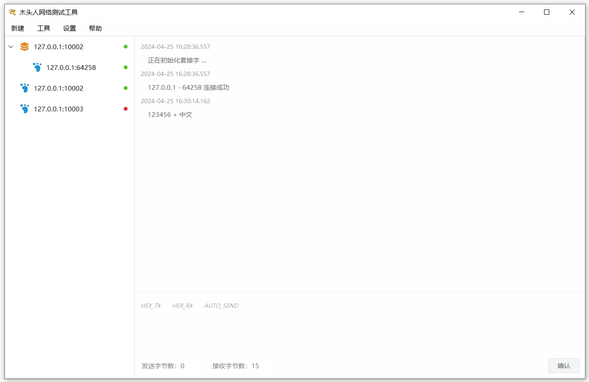
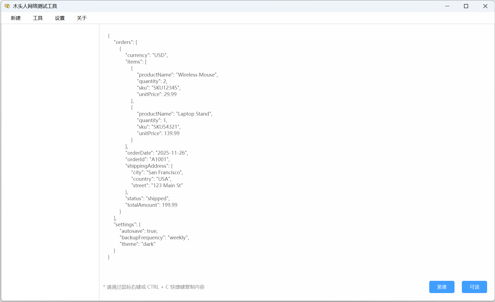
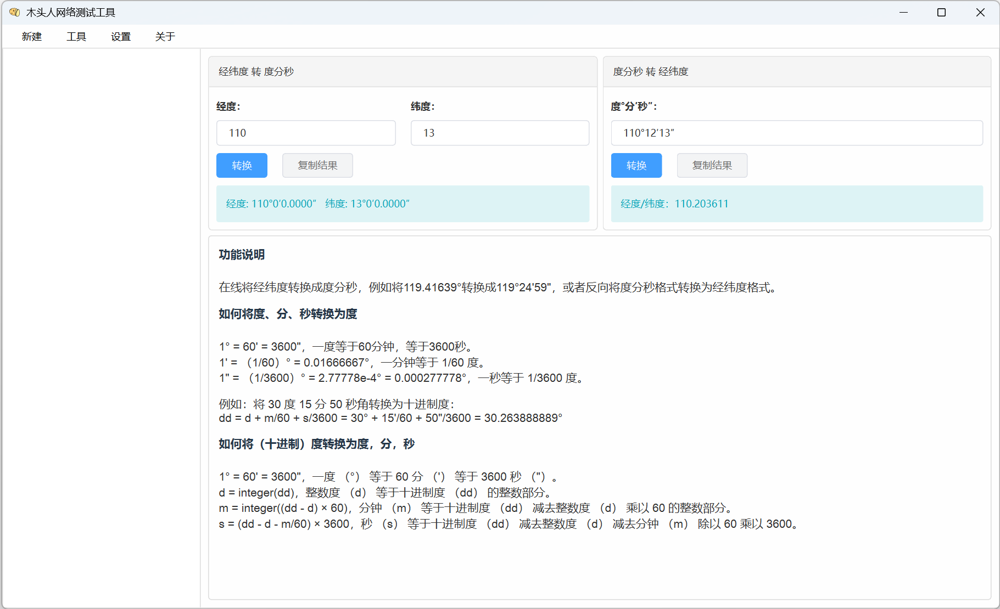

# DeskSocket

#### 一、简介

`DeskSocket` 是一款用于测试网络通信的桌面（`Windows 10`）工具软件，软件支持以下几种功能

* `TCP 服务端` 监听本地端口，接收客户端的 `UDP` 连接，并展示收发的数据。
* `TCP 客户端` 连接远程或本地网络端口，进行数据接收和发送。
* `UDP 服务端` 监听本地端口，接收客户端的 `UDP` 连接，并展示收发的数据。
* `UDP 客户端` 连接远程或本地网络端口，进行数据接收和发送。
* `UDP 广播端` 在本地网卡上进行数据广播。

同时，软件也提供了一些日常工作中常用的计算工具；满足程序员日常工作中对网络数据通信测试的需求。

#### 二、功能展示

* 主界面

  

* `JSON` 格式化工具

  

* 经纬度数据转换工具

  